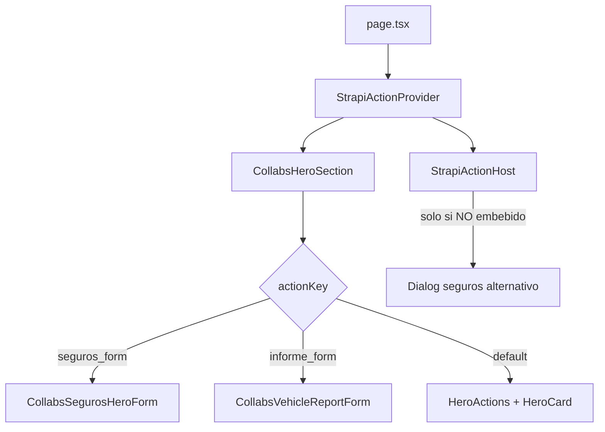

# Colaboraciones: acciones Strapi y formularios embebidos

Documentación del flujo en `/colaboraciones/[slug]` cuando Strapi define una **`key`** de acción en la colaboración.

## Datos de Strapi

Cada colaboración expone (entre otros):

- **`key`**: identificador de comportamiento en frontend (debe coinquidir con `STRAPI_ACTION_KEYS`).
- **`hero`**: título, descripción, imagen, **`acciones`** (CTA), **`card`** (bloque lateral), footer, características.

Las claves soportadas hoy están en [`components/strapi-actions/strapi-action-keys.ts`](../../../components/strapi-actions/strapi-action-keys.ts):

| `key` | Comportamiento |
| --- | --- |
| `seguros_form` | Formulario de lead de seguros embebido en el hero (columna derecha). |
| `informe_form` | Formulario carVertical (matrícula / VIN) embebido en el hero; redirección afiliado. |
| *(otras / sin key)* | Hero estándar: `HeroActions` + `HeroCard` en la derecha. |

## Cadena de render

1. **[`[slug]/page.tsx`](./[slug]/page.tsx)** carga la colaboración y envuelve el contenido en **`StrapiActionProvider`** con `actionKey={colaboracion.key}` y, si aplica, **`embedTargetId`** (id DOM del formulario embebido).
2. **`CollabsHeroSection`** elige layout según `actionKey` (ver [`collabsHeroSection.tsx`](./components/collabsHeroSection.tsx)).
3. **`StrapiActionHost`** solo monta un diálogo cuando la acción **no** está embebida (`embedTargetId` + key conocida ⇒ modo embebido, sin diálogo).

## Modo embebido (`embedTargetId`)

Si `embedTargetId` está definido:

- No se renderiza **`StrapiActionHost`** (no hay modal).
- Los botones Strapi con **`funcion: true`** pueden llamar a `openAction()` y hacer scroll al formulario (útil en seguros si hay CTAs fuera del hero).

Ids de ancla:

| Key | Constante | Archivo |
| --- | --- | --- |
| `seguros_form` | `COLLABS_SEGUROS_HERO_FORM_ID` | `collabsSegurosHeroForm.tsx` |
| `informe_form` | `COLLABS_VEHICLE_REPORT_FORM_ID` | `collabsVehicleReportForm.tsx` |

## `informe_form` (carVertical)

### UI

- **Izquierda del hero**: título, descripción, características y footer (cupón WIAUTO, etc.). **No** se renderizan `hero.acciones` en este caso.
- **Derecha**: [`CollabsVehicleReportForm`](./components/collabsVehicleReportForm.tsx) dentro de una tarjeta blanca (logo y textos de `hero.card`).

### Lógica

- Pestañas **Matrícula** / **Código VIN** (`useState`, no formulario Strapi).
- Campo único `query` en react-hook-form.
- Validación: [`buildCollabsVehicleReportQuerySchema(mode)`](./schemas/collabs-vehicle-report.schema.ts).
- Al enviar:
  1. Normaliza matrícula o VIN.
  2. Construye URL con [`buildCarVerticalReportUrl`](./utils/buildCarVerticalReportUrl.ts) (`sub3` = matrícula o VIN).
  3. `window.open` en nueva pestaña y evento `trackLead`.

Parámetros fijos de afiliado: `uid=293`, `source_id=AFF`, `sub1=wiauto`.

### Strapi recomendado

- **`key`**: `informe_form`
- **`hero.acciones`**: opcionales; no se muestran en el hero embebido. Puedes dejarlas vacías o usarlas solo en otras secciones con `StrapiButton` + `funcion: true` para scroll al formulario.
- **`hero.card`**: logo partner, título y descripción visibles en la tarjeta del formulario.

## `seguros_form`

- Misma idea: formulario en columna derecha, [`CollabsSegurosHeroForm`](./components/collabsSegurosHeroForm.tsx).
- Lead al backend vía `leadsService` (no redirección externa).

## Botones Strapi (`StrapiButton`)

- Enlace normal si el botón tiene **`url`** y **`funcion`** no es true.
- **`funcion: true`** + provider con **`actionKey`**: llama a `openAction(button)` (scroll al embebido o abre diálogo según configuración).

## Añadir una nueva colaboración con acción

1. Registrar la clave en **`strapi-action-keys.ts`** y en Strapi (campo `key` de la colaboración).
2. Decidir: **embebido en hero** (como seguros/informe) o **diálogo** en `StrapiActionHost`.
3. En **`CollabsHeroSection`**, añadir rama `isEmbeddedXForm` si el formulario va en el hero.
4. En **`page.tsx`**, asignar `embedTargetId` si es embebido.
5. Añadir tests en `tests/unit/app/(landing)/colaboraciones/` si hay validación o URLs.

## Tests relacionados

- `tests/unit/app/(landing)/colaboraciones/utils/buildCarVerticalReportUrl.test.ts`
- `tests/unit/app/(landing)/colaboraciones/utils/resolveVehicleReportMode.test.ts` (utilidad por si se reutilizan CTAs con `url`/`label`)
- `tests/unit/app/(landing)/colaboraciones/schemas/collabs-vehicle-report.schema.test.ts`
