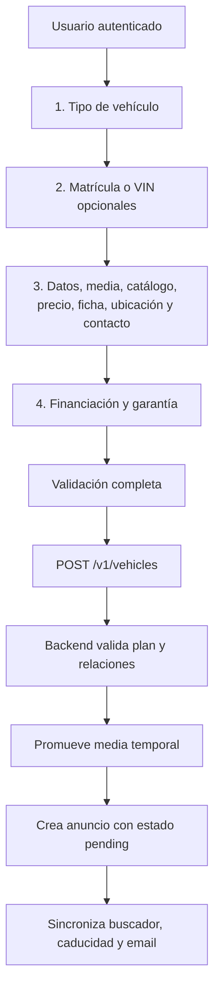

# Creación de vehículos: contrato funcional para clientes mobile

> Referencia construida a partir del frontend Next.js y del backend NestJS vigentes el 16 de agosto de 2026. El objetivo es reproducir en una app mobile el mismo flujo de `/publicar`, no copiar sus componentes visuales.

## 1. Resumen del flujo

La publicación requiere una sesión autenticada y se presenta como un wizard. El formulario conserva todos sus valores mientras el parámetro `step` de la URL cambia.



Rutas web relacionadas:

- Creación: `/publicar`.
- Confirmación: `/publicar/exito?id={vehicleId}`.
- Edición rápida: `/editar-vehiculo/{id}`.
- Edición profesional: `/usuario/editar-vehiculo-profesional/{id}`, protegida por `advanced_listing_editor`.

El proxy web protege `/publicar`. En mobile se debe enviar el access token como `Authorization: Bearer {token}`. El backend también admite la cookie `access_token`, pero no conviene depender de cookies en una app nativa.

Todas las respuestas del backend usan este envoltorio:

```json
{
  "ok": true,
  "status": 200,
  "data": {}
}
```

En errores se debe usar el código HTTP y `message`. Un `401` representa sesión inválida o expirada; `403`, permisos o límites del plan; `429`, rate limit.

## 2. Estado y navegación del wizard

El frontend usa React Hook Form y Zod. En mobile conviene mantener un único estado de borrador para todos los pasos y validar en dos niveles:

1. Antes de avanzar, validar solo lo imprescindible para el paso actual.
2. Antes de publicar, validar el payload completo.

Los pasos superiores actuales son:

1. `Tipo`: exige `vehicle_type_id` antes de avanzar.
2. `Identificación`: matrícula y VIN son opcionales; no bloquea el avance.
3. `Datos del vehículo`: contiene la mayor parte del formulario; la web difiere su validación completa hasta publicar.
4. `Financiación y garantía`: último paso y ubicación del botón de publicación.

La web usa `?step=1..4`. Solo permite pulsar pasos anteriores. También evita que la tecla Enter publique accidentalmente; solo el botón marcado como publicación dispara el submit.

### Paso 1: tipo de vehículo

Se consulta `GET /v1/vehicle-types?page=1&limit=100`. Cada opción utiliza un UUID como `vehicle_type_id` y puede incluir nombre, slug e imagen.

Validación: debe ser un UUID. Aunque el DTO del backend lo admite como opcional, el formulario rápido lo exige.

### Paso 2: identificación opcional

Primero se consulta:

```http
GET /v1/vehicles/identification/availability
Authorization: Bearer {token}
```

Respuesta útil:

```json
{
  "available": true,
  "remaining_requests": 4,
  "total_requests": 5
}
```

Si `available` es verdadero se habilitan las búsquedas:

```http
POST /v1/vehicles/identification/lookup
Authorization: Bearer {token}
Content-Type: application/json

{ "plate": "1234ABC" }
```

o:

```json
{ "vin": "WVWZZZ1JZXW000001" }
```

La matrícula y el VIN se envían sin espacios y en mayúsculas. La web exige al menos 5 caracteres para intentar una matrícula y 11 para intentar un VIN. La validación final solo exige 5 para una matrícula no vacía y 1 para un VIN no vacío.

Una coincidencia rellena:

- `catalog_make_id`, `catalog_model_id`, `catalog_year_id` y `version_id`.
- `transmission_type` y `traction_id`.
- `power` y `displacement`, si existen.
- `license_plate` y `vin_code`, si la respuesta los contiene.

Estados que debe contemplar mobile:

- `404`: no encontrado; permitir entrada manual.
- `429`: límite de búsquedas alcanzado.
- Otros errores: mostrar error genérico y mantener el formulario editable.

### Paso 3: formulario principal

La numeración visual interna vuelve a comenzar y contiene estas secciones.

#### 3.1 Fotos y videos

- Se exigen al menos 3 imágenes para publicar.
- La primera imagen (`order: 0`) funciona como portada.
- Se pueden reordenar; después de cada cambio los órdenes deben ser consecutivos `0..n-1`.
- Los videos son opcionales y solo se muestran cuando `video_upload.value === true`.
- Los límites definitivos los decide el backend mediante entitlements.

El proceso multimedia completo está en la sección 7.

#### 3.2 Catálogo del vehículo

La selección manual sigue esta dependencia:

```text
Marca -> Modelo -> Versión -> Año / Combustible / Carrocería
                         -> Ficha técnica sugerida
```

Al cambiar la marca se limpian modelo, año, versión, combustible, carrocería y datos eléctricos. Al cambiar el modelo se limpian los campos dependientes. Elegir una versión sincroniza su año, combustible y carrocería.

Solo `version_id` se envía como referencia al catálogo en `POST /v1/vehicles`. Los campos `catalog_*` existen para manejar la UI y construir las peticiones dependientes, pero el backend determina marca, modelo, año, combustible y carrocería desde la versión.

#### 3.3 Estado, kilometraje y precio

- `condition`: `new` o `used`.
- `mileage`: número mayor o igual a 0.
- `price`: número mayor o igual a 0.

Reglas adicionales del backend:

- Un vehículo `new` con más de 1.000 km se rechaza.
- Un vehículo `used` con menos de 1.000 km se acepta, pero devuelve una sugerencia para considerarlo nuevo.

La recomendación de precio es opcional. Requiere `version_id`, `condition`, `mileage`, `lat` y `lng`:

```http
POST /v1/vehicles/ai/recommend-price
```

Devuelve `recommended_price`, `range_min`, `range_max`, `sample_count`, `confidence`, `explanation` y `source` (`platform` o `ai`). El usuario decide si aplica `recommended_price` al formulario. El resultado se cachea por usuario y versión durante una hora.

#### 3.4 Clasificación opcional

- Color: `color_id`.
- Categoría: `category_id`.
- Etiqueta ambiental: `dgt_label_id`.

Los tres son UUID opcionales.

#### 3.5 Ficha técnica

Al disponer de `version_id` se consulta `GET /v1/vehicle-specs/{versionId}` para precargar:

- `transmission_type`: `manual` o `automatic`.
- `traction_id`.
- `power`.
- `displacement`.
- `autonomy`, `battery_capacity` y `time_to_charge`.

También se consulta el combustible seleccionado. Si `can_charge` es verdadero, autonomía, capacidad de batería y tiempo de carga pasan a ser obligatorios y mayores que 0. Si es falso, esos tres campos se limpian.

Reglas del backend:

- No se permiten datos eléctricos en un combustible que no admite carga.
- Si el combustible admite carga, `displacement` debe ser 0.

#### 3.6 Equipamiento

`features_ids` es una lista de UUID obtenida de `GET /v1/features?page=1&limit=100`. El backend verifica que todos los IDs existan y elimina duplicados conceptualmente.

El backend también admite `services_ids` desde `GET /v1/services`, pero el selector de servicios no está montado en el formulario rápido actual. Para paridad estricta con la web, mobile puede enviar `[]` y dejar esta capacidad para el editor profesional.

#### 3.7 Descripción e IA

La descripción manual es opcional en el formulario rápido. La generación por IA utiliza:

```http
POST /v1/vehicles/ai/generate-description
```

Requiere como mínimo versión, estado, kilometraje, transmisión, potencia y tracción; el frontend también exige coordenadas válidas. Puede incluir esta configuración:

```json
{
  "settings": {
    "objective": "...",
    "persuasion": "...",
    "extension": "...",
    "tone": "..."
  }
}
```

La descripción generada se copia al campo y sigue siendo editable. El backend permite hasta 3 generaciones nuevas por usuario y hora; una respuesta cacheada para el mismo usuario y versión no vuelve a consumir generación. Un exceso devuelve `429`.

Valores que ofrece actualmente la web para `settings`:

- `objective`: `family`, `young`, `first-car`, `business`, `uber`, `adventurer`, `fuel-saver`, `collector`, `athlete` o `anyone`.
- `persuasion`: `informative`, `balanced`, `persuasive` o `very-seller`.
- `extension`: `very-short`, `short`, `medium`, `long` o `very-detailed`.
- `tone`: `formal`, `professional`, `casual`, `close`, `friendly`, `enthusiastic`, `elegant`, `premium`, `sporty`, `persuasive`, `urgent` o `exclusive`.

Todos pueden enviarse como `null` si el usuario no personaliza la generación.

#### 3.8 Ubicación

Se guardan `lat` y `lng`. La web parte de Madrid (`40.4168`, `-3.7038`) y permite:

- Buscar dirección con Google Places, restringido a España.
- Pulsar sobre Google Maps.
- Usar la geolocalización del dispositivo.

La clave web es `NEXT_PUBLIC_GOOGLE_MAPS_API_KEY`. Mobile puede usar el SDK nativo de mapas; el contrato con WiAuto solo requiere las coordenadas.

Si el usuario tiene una suscripción activa, aparece `show_exact_location`. Si es falso, el anuncio no debe exponer la coordenada exacta públicamente. El backend hace geocodificación inversa al crear y persiste `address` y `address_details`.

#### 3.9 Contacto

- El nombre se muestra desde el perfil y no se envía en el payload.
- `phone_code` y `phone` son obligatorios.
- `email` es obligatorio y se precarga desde `/auth/me` en creación.
- `show_phone` decide si el teléfono aparece públicamente.
- `has_whatsapp` solo debe activarse si existe teléfono.

### Paso 4: financiación y garantía

La intención de la UI es reservar este paso a usuarios con suscripción activa. Incluye:

- `cuota_ids`: selección múltiple desde `GET /v1/cuotas?page=1&limit=100`.
- `finance_price`: precio financiado opcional, mayor o igual a 0.
- `show_first_cuota`: mostrar la primera cuota en el anuncio.
- `by_brand_warranty`: indicar garantía de marca.
- `warranty_type_id`: UUID opcional desde `GET /v1/warranty-types?page=1&limit=100`.

## 3. Catálogos y selectores necesarios

| Selector | Endpoint | Dependencias/parámetros | Valor guardado |
|---|---|---|---|
| Tipo de vehículo | `GET /v1/vehicle-types` | `page=1&limit=100` | UUID |
| Marca | `GET /v1/catalog/makes` | `page`, `limit`, `search` | número |
| Modelo | `GET /v1/catalog/models` | `make_id`, `page`, `limit`, `search` | número |
| Versión | `GET /v1/catalog/versions` | `make_id`, `model_id`, opcionalmente `fuel_type_id`, `year_id`; `page=1&limit=100` | número (`version_id`) |
| Año | `GET /v1/catalog/years` | `model_id`, `page=1&limit=100` | número, solo UI |
| Combustible | `GET /v1/catalog/fuel-types` | `model_id`, `page=1&limit=100` | número, solo UI |
| Carrocería | `GET /v1/catalog/body-types` | `model_id`, `page=1&limit=100` | número, solo UI |
| Ficha por versión | `GET /v1/vehicle-specs/{versionId}` | versión seleccionada | varios campos técnicos |
| Color | `GET /v1/colors` | `page=1&limit=100` | UUID opcional |
| Categoría | `GET /v1/categories` | `page=1&limit=100` | UUID opcional |
| Etiqueta DGT | `GET /v1/dgt-labels` | `page=1&limit=100` | UUID opcional |
| Tracción | `GET /v1/tractions` | `page=1&limit=100` | UUID obligatorio |
| Equipamiento | `GET /v1/features` | `page=1&limit=100` | lista de UUID |
| Servicios del anuncio | `GET /v1/services` | `page=1&limit=100`; no visible en creación rápida | lista de UUID |
| Cuotas | `GET /v1/cuotas` | `page=1&limit=100` | lista de UUID |
| Garantía | `GET /v1/warranty-types` | `page=1&limit=100` | UUID opcional |

Los endpoints paginados responden habitualmente con `data`, `total`, `page` y `limit` dentro del `data` del envoltorio global. Mobile debe implementar búsqueda remota para marca y modelo y cachear los catálogos estáticos.

## 4. Entitlements: origen y uso real

Los entitlements vienen dentro de `billing_summary.entitlements` en `GET /auth/me`. También pueden consultarse directamente con `GET /v1/billing/me`.

Cada entrada tiene esta forma general:

```json
{
  "type": "boolean | limit | unlimited",
  "value": true,
  "limit": 10,
  "used": 2,
  "remaining": 8,
  "unlimited": false
}
```

| Feature | Uso durante creación | Dónde se aplica |
|---|---|---|
| `vehicles` | Máximo de anuncios activos/ocupados | Backend, antes de crear |
| `photos_per_vehicle` | Máximo de fotos por anuncio | Frontend limita el selector; backend vuelve a validar |
| `videos_per_vehicle` | Máximo de videos por anuncio | Backend al crear/actualizar |
| `video_upload` | Permite mostrar y usar la pestaña de videos | Frontend y backend |
| `ai_requests` | Feature medible del sistema de billing | No se consulta actualmente en el formulario rápido |
| `ai_generation` | Capacidad declarada para IA | No oculta actualmente los botones de IA; los endpoints usan JWT y rate limit propio |
| `advanced_listing_editor` | Permite el editor profesional | Ruta de edición profesional, no creación rápida |

Comportamientos complementarios:

- `subscription.status === "active"` controla actualmente la aparición de financiación/garantía y `show_exact_location`. No se usa una feature específica para esos campos.
- Un usuario administrador se considera privilegiado y `has(feature)` devuelve verdadero; el guard de creación omite los límites de publicación.
- La fuente de billing puede ser `subscription`, `dealership_owner`, `dealership`, `free` o `admin`.
- La app mobile debe usar los entitlements para UX, pero siempre tratar el backend como fuente de verdad. Los valores pueden cambiar entre la carga del formulario y el submit.

## 5. Payload final de creación

Petición:

```http
POST /v1/vehicles
Authorization: Bearer {token}
Content-Type: application/json
```

Ejemplo completo:

```json
{
  "vehicle_type_id": "5fc6392e-9406-4b4e-a575-6ddd8e8aa111",
  "vin_code": "WVWZZZ1JZXW000001",
  "license_plate": "1234ABC",
  "version_id": 18237,
  "condition": "used",
  "mileage": 48500,
  "price": 21900,
  "finance_price": 20500,
  "lat": 40.4168,
  "lng": -3.7038,
  "phone_code": "+34",
  "phone": "600123123",
  "email": "vendedor@example.com",
  "show_phone": true,
  "has_whatsapp": true,
  "description": "Vehículo revisado y en muy buen estado.",
  "transmission_type": "automatic",
  "traction_id": "fb523516-8512-4541-a46f-26725fb7eaf5",
  "power": 150,
  "displacement": 1968,
  "show_exact_location": false,
  "show_first_cuota": true,
  "by_brand_warranty": false,
  "color_id": "3d426dab-1bd8-4a41-a9ab-001139fc75ab",
  "category_id": null,
  "dgt_label_id": null,
  "warranty_type_id": null,
  "features_ids": ["01a5ad7d-5114-4aed-989b-63104d6f876c"],
  "services_ids": [],
  "cuota_ids": ["307cb95b-02e2-492d-96cb-f983ed95525d"],
  "images": [
    { "path": "vehicles-images/temp/vehicle-gallery/a.webp", "order": 0 },
    { "path": "vehicles-images/temp/vehicle-gallery/b.webp", "order": 1 },
    { "path": "vehicles-images/temp/vehicle-gallery/c.webp", "order": 2 }
  ],
  "videos": []
}
```

Para un eléctrico o híbrido enchufable se agregan `autonomy`, `battery_capacity` y `time_to_charge`, todos mayores que 0, y se envía `displacement: 0`.

No enviar `catalog_make_id`, `catalog_model_id`, `catalog_year_id`, `catalog_body_type_id`, `catalog_fuel_type_id` ni `catalog_fuel_can_charge`: son estado de interfaz. El backend usa `whitelist: true`, pero el cliente mobile debe construir un DTO limpio.

El serializador web además:

- Convierte `{ phone_code, phone }` del control compuesto en dos campos raíz.
- Conserva `images` y `videos` como `{path, order}`.
- Omite `vehicle_price_id` en create; solo puede usarse al actualizar.

La respuesta real de creación contiene el recurso bajo `data.vehicle`:

```json
{
  "ok": true,
  "status": 201,
  "data": {
    "vehicle": {
      "id": "uuid-del-vehiculo",
      "ref": 12345,
      "status": "pending",
      "suggestions": []
    }
  }
}
```

Tras crear:

- El estado inicial es `pending`.
- El publicador se decide en backend: `dealership` si el perfil pertenece a una concesionaria; en caso contrario, `particular`. No confiar en `publisher_type` enviado por el cliente.
- El anuncio caduca inicialmente a los 90 días.
- Se crea un registro de precio activo.
- Se sincroniza el índice de búsqueda, se programa la caducidad y se encola el email de publicación.

## 6. Validación completa antes de publicar

Campos exigidos por el formulario rápido:

- UUID: `vehicle_type_id`, `traction_id`.
- Número positivo: `version_id`.
- Enum: `condition`, `transmission_type`.
- Números no negativos: `mileage`, `price`, `displacement`.
- `power`: al menos 1 en el schema actual.
- Coordenadas numéricas: `lat`, `lng`.
- Contacto: prefijo, teléfono y email válido.
- `images`: mínimo 3.
- IDs opcionales: UUID o `null`/ausente según el campo.
- Arrays de relaciones: listas de UUID.
- Los booleanos `show_exact_location`, `show_first_cuota` y `by_brand_warranty` deben enviarse explícitamente; el DTO backend los tipa como opcionales, pero actualmente no llevan `@IsOptional()`.

La validación backend vuelve a comprobar versión, combustible, relaciones, reglas de kilometraje, compatibilidad eléctrica y límites del plan. Mobile debe mostrar literalmente el `message` del backend cuando sea útil y conservar el borrador para que el usuario corrija el dato.

## 7. Subida de imágenes

Las imágenes se suben antes de crear el vehículo. No se envía el binario dentro de `POST /v1/vehicles`.

### Restricciones

- La web acepta JPG/JPEG, PNG, WebP, AVIF, HEIC/HEIF, GIF, BMP y TIFF.
- El backend limita cada imagen a 10 MiB.
- HEIC/HEIF y AVIF se convierten; la imagen se optimiza y se guarda como media temporal.
- Se requieren al menos 3 imágenes.
- El máximo proviene de `photos_per_vehicle.limit`.

### Secuencia

1. Crear una preview local para que la UI responda inmediatamente.
2. Enviar cada imagen individualmente:

```http
POST /v1/upload-temp-vehicle-image
Authorization: Bearer {token}
Content-Type: multipart/form-data

file={binary}
```

3. Leer:

```json
{
  "path": "vehicles-images/temp/vehicle-gallery/{uuid}.webp",
  "preview_url": "https://..."
}
```

Estos campos están dentro de `data` por el envoltorio global.

4. Guardar en el draft únicamente `{ "path": path, "order": n }`. `preview_url` sirve para UI, no para crear el vehículo.
5. Permitir reordenar y renumerar desde 0.
6. Al publicar, enviar todos los paths temporales en `images`.
7. El backend promueve cada path fuera de `temp`, persiste las rutas finales y asocia las imágenes al nuevo vehículo.

Para cancelar o eliminar una subida confirmada:

```http
DELETE /v1/files
Authorization: Bearer {token}
Content-Type: application/json

{
  "bucket_name": "vehicles-images",
  "paths": ["temp/vehicle-gallery/{uuid}.webp"]
}
```

La ruta compuesta se divide en el primer `/`: la primera parte es `bucket_name` y el resto es la clave de objeto.

## 8. Subida de videos

La pestaña solo debe existir cuando `video_upload.value` sea verdadero. El máximo final es `videos_per_vehicle.limit`.

### Restricciones del cliente web

- Formatos: MP4, MOV, WEBM, AVI y MKV.
- Máximo: 100 MiB por video.
- Duración máxima: 3 minutos, validada leyendo metadatos locales.
- `video/quicktime` se normaliza a `video/mov`; AVI y MKV también se normalizan a los MIME admitidos por backend.

### Secuencia de subida directa

1. Generar una clave única y pedir URL firmada:

```http
POST /v1/generate-file-signed-url
Authorization: Bearer {token}
Content-Type: application/json

{
  "file_key": "vehicles-videos/{uuid}.mov",
  "content_type": "video/mov",
  "bucket_name": "vehicles-videos"
}
```

2. Leer `data.signed_url`.
3. Hacer `PUT` del binario directamente a esa URL, usando el mismo `Content-Type`. Esta petición no va al API de WiAuto y no lleva su bearer token.
4. Confirmar la subida:

```http
POST /v1/confirm-video-upload
Authorization: Bearer {token}
Content-Type: application/json

{ "file_key": "vehicles-videos/{uuid}.mov" }
```

5. El backend encola la transcodificación y responde de inmediato con:

```json
{
  "file_key": "vehicles-videos/{uuid}.mov",
  "file_key_en_storage": "vehicles-videos/{uuid}.mp4"
}
```

6. Guardar el path compuesto esperado como `vehicles-videos/{file_key_en_storage}` y un `order` consecutivo.
7. Mostrar estado de procesamiento; la confirmación no significa que el MP4 ya esté disponible. El worker descarga el original, lo procesa con FFmpeg, escribe el `.mp4` y borra el original si cambia la extensión.

Los videos también se eliminan con `DELETE /v1/files`, usando `bucket_name: "vehicles-videos"`.

## 9. Inventario de endpoints del flujo

| Método | Endpoint | Uso |
|---|---|---|
| `GET` | `/auth/me` | Usuario, email, membresía y `billing_summary` |
| `GET` | `/v1/billing/me` | Estado de billing y entitlements actualizado |
| `GET` | `/v1/vehicle-types` | Tipo de vehículo |
| `GET` | `/v1/vehicles/identification/availability` | Disponibilidad/cuota de identificación |
| `POST` | `/v1/vehicles/identification/lookup` | Consulta por matrícula o VIN |
| `GET` | `/v1/catalog/makes` | Marcas |
| `GET` | `/v1/catalog/models` | Modelos por marca |
| `GET` | `/v1/catalog/versions` | Versiones por marca/modelo |
| `GET` | `/v1/catalog/years` | Años por modelo |
| `GET` | `/v1/catalog/fuel-types` | Combustibles por modelo |
| `GET` | `/v1/catalog/body-types` | Carrocerías por modelo |
| `GET` | `/v1/vehicle-specs/{versionId}` | Ficha técnica de la versión |
| `GET` | `/v1/colors` | Colores |
| `GET` | `/v1/categories` | Categorías |
| `GET` | `/v1/dgt-labels` | Etiquetas DGT |
| `GET` | `/v1/tractions` | Tracciones |
| `GET` | `/v1/features` | Equipamiento |
| `GET` | `/v1/services` | Servicios opcionales; no visible en creación rápida |
| `GET` | `/v1/cuotas` | Opciones de financiación |
| `GET` | `/v1/warranty-types` | Tipos de garantía |
| `POST` | `/v1/vehicles/ai/recommend-price` | Precio sugerido |
| `POST` | `/v1/vehicles/ai/generate-description` | Descripción generada |
| `POST` | `/v1/upload-temp-vehicle-image` | Subida y optimización de una imagen |
| `POST` | `/v1/generate-file-signed-url` | URL firmada para video |
| `PUT` | URL firmada externa | Binario del video directo al storage |
| `POST` | `/v1/confirm-video-upload` | Confirmación y cola de transcodificación |
| `DELETE` | `/v1/files` | Eliminar objeto almacenado |
| `POST` | `/v1/vehicles` | Crear anuncio |
| `GET` | `/v1/vehicles/{id}` | Recuperar detalle para edición/preview |
| `PATCH` | `/v1/vehicles/{id}` | Actualizar anuncio existente |

## 10. Diferencias y riesgos detectados en la implementación actual

Estos puntos describen el código vigente y deben resolverse antes de considerar el comportamiento web como contrato definitivo:

1. **Respuesta de creación:** el backend devuelve el ID en `data.vehicle.id`, pero `QuickVehicleForm` busca `response.data.id`. La creación puede ser correcta y aun así la web navegar a éxito sin el ID.
2. **Paths de video:** `VehicleMediaHttpDto` exige que todos los paths incluyan el segmento `temp`; el flujo actual de video genera `vehicles-videos/...` sin `temp`. Además, create intenta promover imágenes y videos como temporales. Esto puede hacer que el backend rechace un video válido antes de crear el anuncio.
3. **Paso de financiación:** el Stepper oculta el paso 4 a usuarios sin suscripción, pero `totalSteps` continúa siendo 4 y la navegación puede llevar igualmente a ese paso. Mobile debe decidir explícitamente si omite el paso o muestra una pantalla de upgrade.
4. **Validación por paso:** solo el paso 1 declara campos para `trigger`; los pasos 2, 3 y 4 difieren sus errores hasta el submit final.
5. **Límite visual de fotos:** el selector web limita cada lote seleccionado, pero no descuenta de forma robusta las imágenes ya subidas o pendientes. El backend es quien evita exceder el total real.
6. **Entitlements de IA:** `ai_generation` y `ai_requests` están definidos en billing, pero el formulario rápido no los usa para ocultar/deshabilitar las acciones. Hoy mandan el JWT, el cache y los rate limits específicos.
7. **Edición rápida:** el wizard oculta navegación y Stepper en modo edición, aunque el paso activo sigue dependiendo de `?step`; conviene no replicar este comportamiento en mobile.
8. **Path duplicado de video:** `generateFileKey` ya antepone `vehicles-videos/` y, tras confirmar, el cliente vuelve a anteponer `vehicles-videos/`. El path resultante puede quedar como `vehicles-videos/vehicles-videos/{uuid}.mp4`.
9. **Límites ilimitados:** los guards comparan directamente contra `entitlement.limit`; conviene probar expresamente planes cuyo límite esté representado por `null`/`unlimited`, porque la rama actual puede interpretarlos como ausencia de permiso.
10. **Vehículos eléctricos:** el formulario pone `power` y `displacement` en 0 al detectar un combustible recargable, pero su schema exige `power >= 1`. El contrato backend permite omitir potencia; mobile no debería copiar esa contradicción.
11. **Tracción precargada:** `GET /v1/vehicle-specs/{versionId}` está tipado en frontend con `traction_id` numérico y luego se convierte a string, mientras el DTO final exige UUID. Confirmar el contrato de este endpoint antes de confiar en la precarga.

## 11. Implementación mobile recomendada

1. Al abrir publicación, validar/renovar sesión y cargar `/auth/me` o `/v1/billing/me`.
2. Crear un draft local persistente para tolerar cierre de app, pérdida de red y subida multimedia larga.
3. Cargar catálogos de forma lazy y cachearlos; invalidar descendientes cuando cambia marca/modelo/versión.
4. Subir media de manera independiente y guardar solo paths confirmados en el draft.
5. Bloquear publicación mientras existan uploads pendientes.
6. Aplicar límites de entitlements en UI y volver a manejar `403` del backend.
7. Validar todo el DTO antes del `POST /v1/vehicles`.
8. En éxito, leer `data.vehicle.id`, limpiar el draft y abrir la confirmación/detalle.
9. En error, conservar el draft y asociar mensajes a campos cuando sea posible.
10. Añadir telemetría para abandono por paso, fallos de subida, `403`, `429` y errores de catálogo.

## 12. Archivos fuente de referencia

Frontend:

- `app/(public)/publicar/page.tsx`
- `components/vehicles/quick-publish/QuickVehicleForm.tsx`
- `components/vehicles/quick-publish/QuickVehicleIntroWizard.tsx`
- `components/vehicles/quick-publish/QuickVehicleMainSections.tsx`
- `components/vehicles/schemas/quick-vehicle.schema.ts`
- `components/vehicles/utils/serializeVehiclePayload.ts`
- `components/vehicles/forms/imagesForm.tsx`
- `components/vehicles/forms/videosForm.tsx`
- `services/files/filesService.ts`
- `hooks/useEntitlements.ts`

Backend:

- `src/contexts/vehicles/api/v1/create-vehicle/create-vehicle.controller.ts`
- `src/contexts/vehicles/api/v1/create-vehicle/create-vehicle.http-dto.ts`
- `src/contexts/vehicles/api/v1/create-vehicle/create-vehicle.service.ts`
- `src/contexts/vehicles/guards/vehicleCreation.guard.ts`
- `src/contexts/shared/file/api/upload-temp-vehicle-image/`
- `src/contexts/shared/file/api/generate-file-signed-url/`
- `src/contexts/shared/file/api/confirm-video-upload/`
